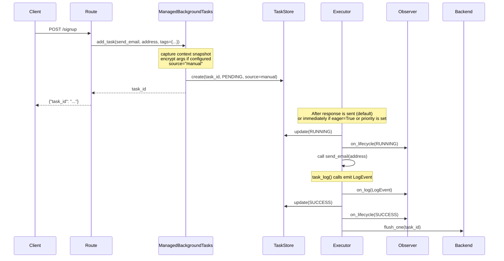
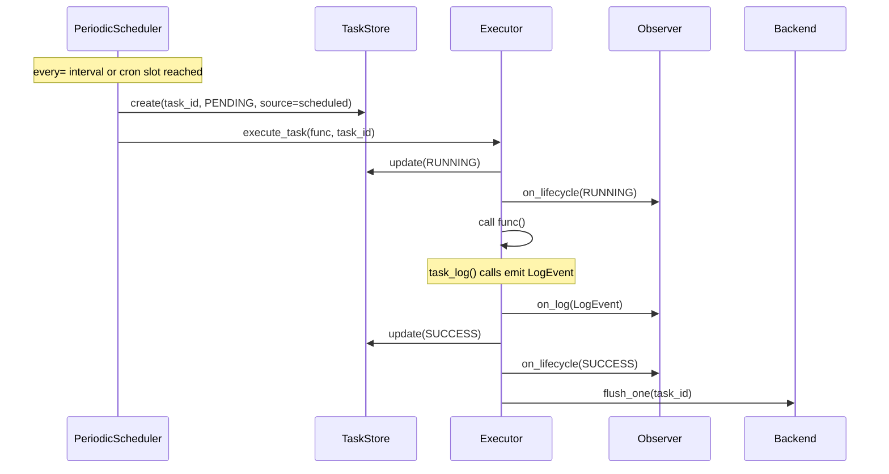

# Quick Start

By the end of this page you will have a working FastAPI app that enqueues background tasks, retries them on failure, tracks their status, and exposes a live dashboard, all without changing how you write standard FastAPI routes.

## What you will build

A small FastAPI app with two background tasks, a signup endpoint that enqueues work, and the full task management API mounted automatically. You will be able to submit a task, watch it run, and inspect its status from the terminal.

## Full working example

Here is the complete app. The sections below walk through each piece in detail.

```python
import time

from fastapi import BackgroundTasks, FastAPI
from fastapi_taskflow import TaskAdmin, TaskManager

# 1. Create the task manager
task_manager = TaskManager(snapshot_db="tasks.db", snapshot_interval=30.0)
app = FastAPI()

# 2. Mount the admin routes and wire up lifecycle management
TaskAdmin(app, task_manager, auto_install=True)


# 3. Define tasks
@task_manager.task(retries=3, delay=1.0, backoff=2.0)
def send_email(address: str) -> None:
    time.sleep(0.05)
    print(f"Sending email to {address}")


@task_manager.task(retries=1, delay=0.5)
async def process_webhook(payload: dict) -> None:
    print(f"Processing webhook: {payload}")


# 4. Use tasks in routes
@app.post("/signup")
def signup(email: str, background_tasks: BackgroundTasks):
    task_id = background_tasks.add_task(send_email, address=email)
    return {"task_id": task_id}
```

## Step-by-step walkthrough

### Step 1: Create the task manager

```python
task_manager = TaskManager(snapshot_db="tasks.db", snapshot_interval=30.0)
```

`TaskManager` is the central coordinator. It owns the task store, the executor, and the retry logic.

`snapshot_db` points to a SQLite file where task state is persisted. If the process restarts, tasks that were in-flight are recovered from this snapshot. Set it to `None` if you only need in-memory tracking.

`snapshot_interval` controls how often the in-memory state is flushed to disk, in seconds. Thirty seconds is a reasonable default for most apps.

!!! note "Using Redis or PostgreSQL instead?"
    SQLite is the default backend and requires no extra dependencies. If you need a shared backend across multiple worker processes, see [Backends](../guide/backends.md).

### Step 2: Mount TaskAdmin

```python
TaskAdmin(app, task_manager, auto_install=True)
```

`TaskAdmin` does two things at once.

First, it mounts the task management routes under `/tasks`. This gives you status endpoints, metrics, and the dashboard for free.

Second, `auto_install=True` replaces FastAPI's default `BackgroundTasks` with `ManagedBackgroundTasks` throughout your entire app. This is what makes `add_task` return a task ID and enables retry logic, without requiring any changes to your route signatures.

!!! tip
    If you prefer to opt in per-route rather than globally, set `auto_install=False` and import `ManagedBackgroundTasks` directly where you need it. See [Task Manager](../guide/task-manager.md) for details.

### Step 3: Define tasks

```python hl_lines="1 5"
@task_manager.task(retries=3, delay=1.0, backoff=2.0)
def send_email(address: str) -> None:
    ...

@task_manager.task(retries=1, delay=0.5)
async def process_webhook(payload: dict) -> None:
    ...
```

The `@task_manager.task` decorator registers a function as a managed task. Both sync and async functions are supported.

`retries` sets how many times the task will be retried after a failure. `delay` is the initial wait time in seconds before the first retry. `backoff` is a multiplier applied to the delay on each subsequent retry, so with `delay=1.0` and `backoff=2.0` the retries wait 1 s, then 2 s, then 4 s.

!!! info "Retries are optional"
    You can register a task with no arguments at all: `@task_manager.task()`. It will run once with no retry behavior.

### Step 4: Use tasks in routes

```python
@app.post("/signup")
def signup(email: str, background_tasks: BackgroundTasks):
    task_id = background_tasks.add_task(send_email, address=email)
    return {"task_id": task_id}
```

The route signature is identical to standard FastAPI. You do not need to import anything extra. Because `auto_install=True` is set, FastAPI injects a `ManagedBackgroundTasks` instance instead of the plain one.

The key difference from standard FastAPI is that `add_task` now returns a UUID string you can use to track the task's progress.

## Run it

Save the code above to a file, for example `main.py`, then start the server:

```bash
uvicorn main:app --reload
```

!!! note
    If you copied the example above verbatim, replace `examples.basic_app:app` with the correct module path for your file.

## Test it from the terminal

With the server running, open a second terminal and try these commands:

```bash
# Enqueue a task and get back its ID
curl -X POST "http://localhost:8000/signup?email=user@example.com"

# List all tasks
curl "http://localhost:8000/tasks"

# Get the status of a specific task (replace <task_id> with the ID from above)
curl "http://localhost:8000/tasks/<task_id>"

# View aggregated metrics
curl "http://localhost:8000/tasks/metrics"

# Open the live dashboard in your browser
open "http://localhost:8000/tasks/dashboard"
```

The dashboard auto-refreshes and shows each task's status, retry count, duration, and logs in real time.

## What happens end to end

These diagrams show the full lifecycle of a task from the moment a request arrives to the moment the result is persisted.

**Manual task flow**



**Scheduled task flow**



## What to read next

Now that you have a working app, here are the most useful next steps depending on what you want to do:

- **Add more tasks and control their behavior** — [Defining Tasks](../guide/defining-tasks.md) and [Adding Tasks](../guide/adding-tasks.md)
- **Switch to Redis or PostgreSQL for persistence** — [Backends](../guide/backends.md)
- **Schedule tasks to run automatically** — [Scheduled Tasks](../guide/scheduled-tasks.md)
- **Explore the dashboard** — [Dashboard](../guide/dashboard.md)
- **Understand all the management endpoints** — [Task Manager](../guide/task-manager.md)
