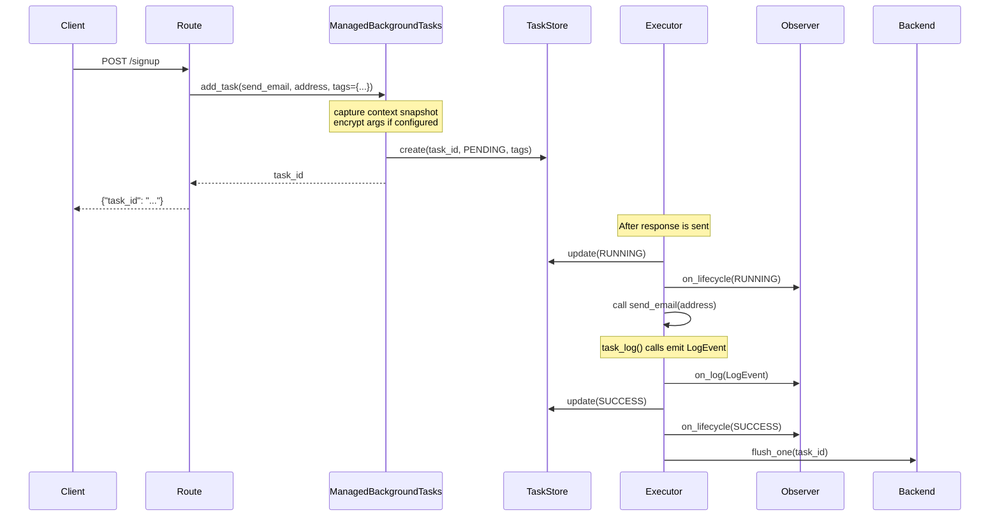

# Quick Start

This page walks through a complete working example from setup to first request.

## 1. Set up the task manager

```python
from fastapi import BackgroundTasks, FastAPI
from fastapi_taskflow import TaskAdmin, TaskManager

task_manager = TaskManager(snapshot_db="tasks.db", snapshot_interval=30.0)
app = FastAPI()

# Mounts /tasks routes and wires up the snapshot lifecycle.
# auto_install=True patches FastAPI's injection so bare BackgroundTasks
# annotations receive a ManagedBackgroundTasks instance.
TaskAdmin(app, task_manager, auto_install=True)
```

## 2. Define tasks

```python
import time

@task_manager.task(retries=3, delay=1.0, backoff=2.0)
def send_email(address: str) -> None:
    time.sleep(0.05)
    print(f"Sending email to {address}")

@task_manager.task(retries=1, delay=0.5)
async def process_webhook(payload: dict) -> None:
    print(f"Processing webhook: {payload}")
```

Both sync and async functions are supported.

## 3. Use in routes

```python
@app.post("/signup")
def signup(email: str, background_tasks: BackgroundTasks):
    task_id = background_tasks.add_task(send_email, address=email)
    return {"task_id": task_id}
```

The route signature is unchanged from standard FastAPI. `add_task` now returns a UUID string you can use for tracking.

## 4. Run it

```bash
uvicorn examples.basic_app:app --reload
```

```bash
# Enqueue a task
curl -X POST "http://localhost:8000/signup?email=user@example.com"

# List all tasks
curl "http://localhost:8000/tasks"

# Get a specific task
curl "http://localhost:8000/tasks/<task_id>"

# Metrics
curl "http://localhost:8000/tasks/metrics"

# Live dashboard
open "http://localhost:8000/tasks/dashboard"
```

## What happens end to end


