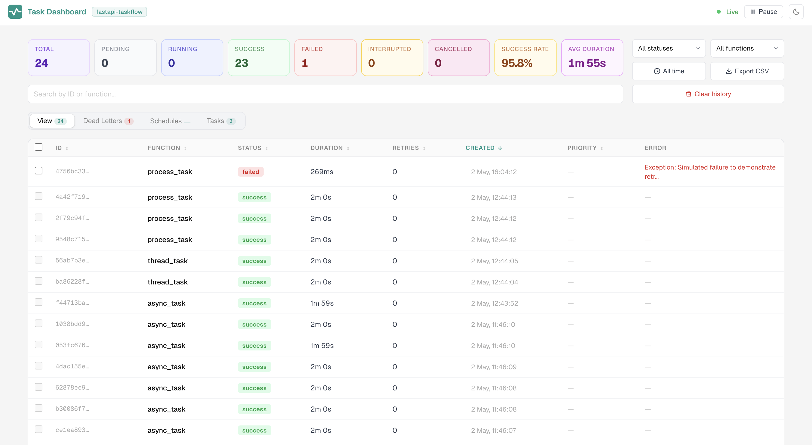
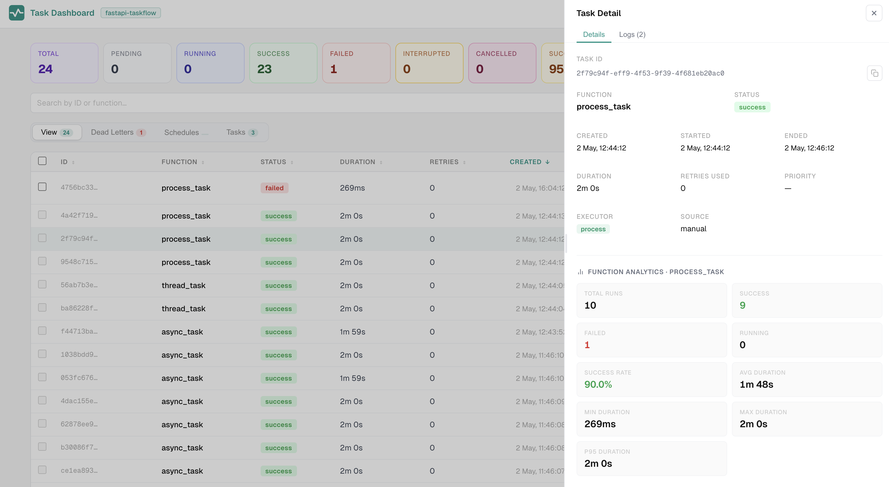
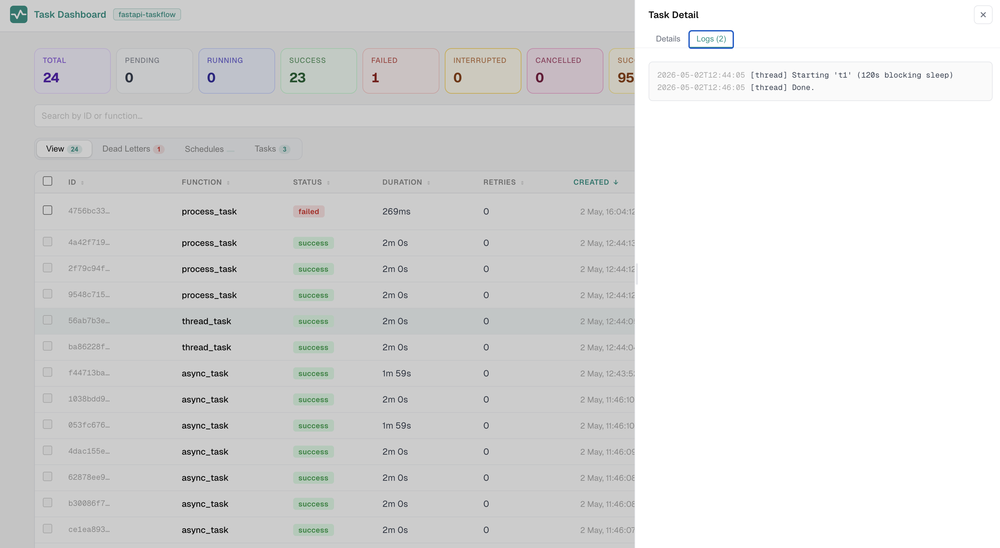
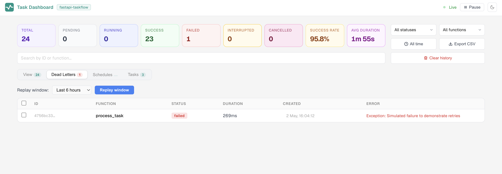
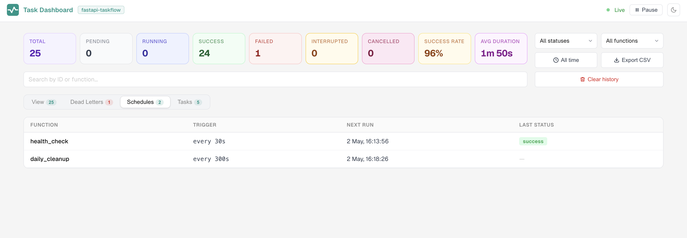
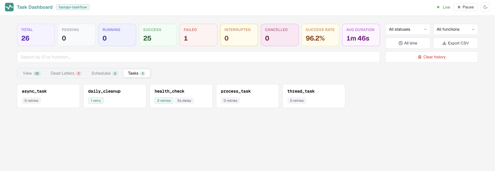

# Dashboard

The dashboard is a live admin UI that gives you real-time visibility into every task your application runs, with controls to inspect, retry, cancel, and export them, all without writing any extra code.

<a href="../../assets/images/dashboard.png" target="_blank" class="img-link">
  
</a>

---

## Accessing the Dashboard

The dashboard is mounted automatically when you use `TaskAdmin`:

```python
TaskAdmin(app, task_manager)
# Dashboard available at /tasks/dashboard
```

You can mount it at a custom path:

```python
TaskAdmin(app, task_manager, path="/admin/tasks")
# Dashboard available at /admin/tasks/dashboard
```

If you have configured authentication, you will be prompted to log in before the dashboard loads:

```python
TaskAdmin(app, task_manager, auth=("admin", "secret"))
```

See the [Authentication guide](authentication.md) for full details on protecting the dashboard and API endpoints.

---

## The View Tab

The **View** tab is the main task table. It updates live over a Server-Sent Events stream, so you see new tasks and status changes the moment they happen, with no polling and no page refresh.

### Columns

Each row in the table shows:

| Column | What it shows |
|---|---|
| ID | The task UUID, with a copy-to-clipboard button |
| Function | The registered function name |
| Status | Current status badge |
| Duration | Wall-clock time from start to end |
| Retries | Number of retry attempts consumed |
| Created | When the task was enqueued |
| Error | A short summary of the exception, if any |

Columns are sortable by clicking the column header. Your sort preference is saved in `localStorage` and restored on your next visit.

### Filtering and Search

Four controls sit above the table:

- **Status dropdown** filters to a single status (pending, running, success, failed, interrupted, cancelled).
- **Function dropdown** narrows the table to one registered function.
- **Time-range picker** shows tasks created within a chosen window. You enter a number and pick a unit (minutes, hours, or days).
- **Search bar** matches against both the task ID and the function name as you type. Your search term is persisted in `localStorage` across reloads.

All active filters combine: a task must pass every one of them to appear in the table. The table paginates at 30 tasks per page.

### Metrics Row

Above the table, a row of stat cards summarises the current filtered view:

| Stat | What it shows |
|---|---|
| Total | Count of all tasks matching the active filters |
| Pending / Running / Success / Failed / Interrupted / Cancelled | Count per status |
| Success rate | Percentage of terminal tasks that ended in `success` |
| Avg duration | Mean wall-clock time across completed tasks |
| Min / Max duration | Fastest and slowest recorded run |
| P95 duration | The 95th-percentile duration, useful for spotting outliers |

---

## Task Detail Panel

Click any row to open a slide-in detail panel for that task.

<a href="../../assets/images/task_details.png" target="_blank" class="img-link">
  
</a>

### Details Tab

The **Details** tab shows everything about the task:

- Task ID with a copy button
- Function name and current status
- Timestamps: created, started, and ended
- Duration and retry count
- Task arguments (when `display_func_args=True` is set on `TaskAdmin`)
- Per-function analytics: total runs, success and failure counts, success rate, avg/min/max/P95 duration across all recorded runs of the same function
- The five most recent runs of the same function, as a quick history

### Logs Tab

The **Logs** tab appears when the task has captured log output. It shows the log lines emitted during that run.

<a href="../../assets/images/logs.png" target="_blank" class="img-link">
  
</a>

### Error Tab

The **Error** tab appears when the task ended with an exception. It shows the full traceback so you can diagnose the failure without leaving the dashboard.

<a href="../../assets/images/error.png" target="_blank" class="img-link">
  
</a>

### Action Buttons

The available buttons depend on the task's current status:

| Status | Action |
|---|---|
| `pending` | **Cancel task** sets the status to `cancelled` immediately. |
| `running` | **Cancel task** sends a cancellation signal to the asyncio task. A note in the panel explains that sync tasks (running in a thread pool) cannot be interrupted mid-thread. |
| `failed` or `interrupted` | **Retry this task** creates a new task with the same function, args, and kwargs. The original record stays in history unchanged. |

!!! warning
    For interrupted tasks, the retry button shows a warning that the function may have already partially executed. Only retry if you know the function is safe to run again from the beginning.

---

## Dead Letters Tab

The **Dead Letters** tab shows only tasks with status `failed`, sorted newest first. The tab badge shows the current failed count at a glance.

<a href="../../assets/images/dead_letters.png" target="_blank" class="img-link">
  
</a>

### Retrying Individual Tasks

Each row in the Dead Letters table has a checkbox. Select one or more tasks, and a bulk action bar appears with a **Replay selected** button. Clicking it re-enqueues only the checked tasks with their original function, args, and kwargs. The selection clears automatically after dispatch.

### Replaying by Time Window

A toolbar above the table lets you pick a time window (last 1 hour, 6 hours, 24 hours, 7 days, or all time) and click **Replay window**. A confirmation modal summarises how many tasks will be re-enqueued before anything is dispatched.

!!! note
    Both replay actions are recorded in the audit log with action type `bulk_retry`.

---

## Schedules Tab

The **Schedules** tab lists every function registered with `@task_manager.schedule()`. For each schedule you can see:

<a href="../../assets/images/schedule_tab.png" target="_blank" class="img-link">
  
</a>

- The function name
- The trigger expression (an interval in seconds or a cron string)
- The next scheduled run time
- The status of the most recent run

---

## Tasks Tab

The **Tasks** tab lists all functions registered with `@task_manager.task()` or `@task_manager.schedule()`. Each entry shows the function name along with its configuration: retry count, retry delay, backoff multiplier, and the boolean flags `persist` and `requeue_on_interrupt`.

<a href="../../assets/images/tasks_tab.png" target="_blank" class="img-link">
  
</a>

This is a convenient reference when you want to confirm what configuration is active for a given function.

---

## Audit Tab

The **Audit** tab records every retry and cancel action taken via the dashboard or API. Each entry shows:

- Timestamp
- Action type (`retry`, `cancel`, or `bulk_retry`)
- The affected task ID
- The username of whoever performed the action

!!! info
    The Audit tab is only shown when `auth` is configured on `TaskAdmin`. When auth is not configured, all actions are attributed to `"anonymous"` and the tab is hidden. The log keeps the last 1000 entries in memory.

---

## Pausing Live Updates

The **Pause** button stops the dashboard from re-rendering as new SSE events arrive. Incoming events are buffered, and a counter shows how many new tasks have come in while updates are paused.

This is useful when you are inspecting a specific row or reading through task details and do not want the table to shift around underneath you. Click **Resume** to flush the buffer and catch up.

---

## Exporting Tasks

The **Export CSV** button downloads the current filtered and sorted view as a `.csv` file named `tasks-YYYY-MM-DD.csv`. The export reflects whatever filters are active at the time you click.

Exported columns: `ID`, `Function`, `Status`, `Duration (ms)`, `Retries`, `Created`, `Error`.

---

## Clearing History

The **Clear history** button deletes completed tasks that are older than a window you choose. Only tasks with a terminal status (`success`, `failed`, or `cancelled`) are removed. Pending and running tasks are never deleted.

You can also configure automatic retention so old records are pruned on a schedule:

```python
TaskManager(snapshot_db="tasks.db", retention_days=30)
```

Or override the setting at mount time via `TaskAdmin`:

```python
TaskAdmin(app, task_manager, retention_days=30)
```

Pruning runs approximately every 6 hours during the snapshot loop.

---

## Multi-Instance Note

When you run multiple instances behind a load balancer, the **live task table shows only the tasks running on the instance your browser's SSE connection is attached to**. Completed tasks from all instances are visible through the shared backend.

!!! tip
    For consistent live visibility, route dashboard traffic to a single instance using sticky sessions. See the [multi-instance guide](multi-instance.md) for details.
