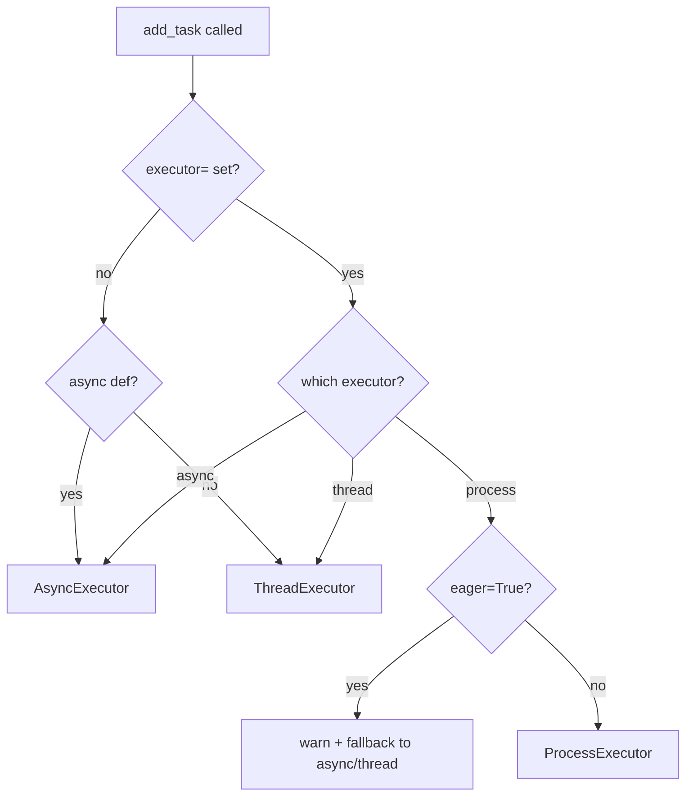
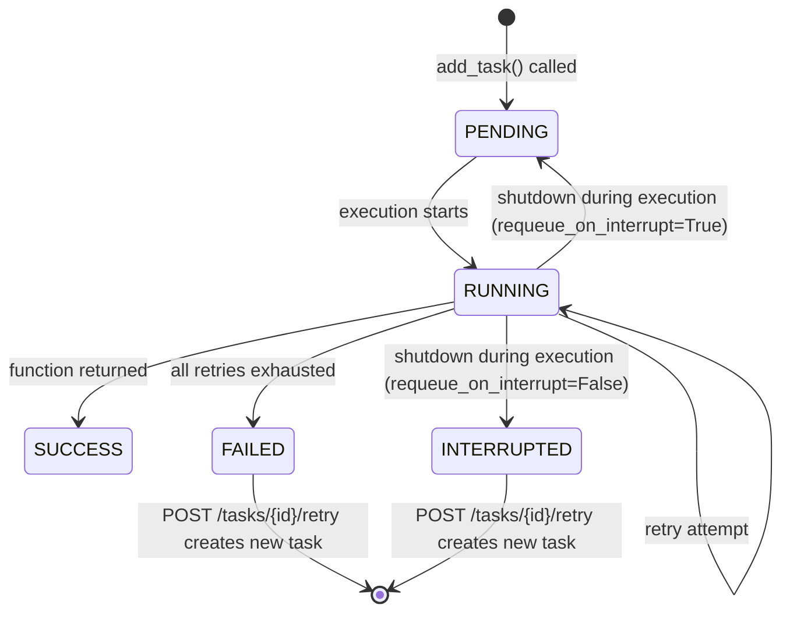

# Defining Tasks

This page explains how to define tasks, what configuration options are available, and how the task lifecycle works.

## Why use the decorator?

You can pass any plain function to `add_task()` and it will be tracked with a UUID and run as a background task. But without the decorator, you get no retries, no persist-on-startup behavior, and no custom name in the dashboard.

The decorator is how you attach execution configuration to a function once, so you never have to repeat it at call sites.

## Basic definition

```python
from fastapi_taskflow import TaskManager

task_manager = TaskManager()

@task_manager.task()
def send_email(address: str) -> None:
    ...
```

Without any arguments, the task runs once with no retries. This is the right starting point for most tasks.

## Decorator options

| Parameter | Type | Default | Description |
|-----------|------|---------|-------------|
| `retries` | `int` | `0` | Additional attempts after the first failure |
| `delay` | `float` | `0.0` | Seconds to wait before the first retry |
| `backoff` | `float` | `1.0` | Multiplier applied to `delay` on each retry |
| `persist` | `bool` | `False` | Save this task record for requeue on startup |
| `name` | `str` | function name | Override the display name in the dashboard and logs |
| `requeue_on_interrupt` | `bool` | `False` | Save as PENDING if interrupted at shutdown, then requeue on next startup |
| `eager` | `bool` | `False` | Dispatch via `asyncio.create_task` immediately when `add_task()` is called, before the response is sent |
| `priority` | `int \| None` | `None` | Route through the priority queue instead of the standard task list. Higher values run first |
| `executor` | `"async" \| "thread" \| "process" \| None` | `None` | Force a specific executor. `None` auto-detects: `async` for coroutines, `thread` for sync functions |

**When would you use each option?**

- `retries` + `delay` + `backoff`: Any task that calls an external service and should survive transient failures.
- `persist`: Tasks that must not be lost if the process restarts before they complete.
- `name`: When the function name is unclear or generated, and you want a human-readable label in the dashboard.
- `requeue_on_interrupt`: For idempotent tasks where running from scratch after an unclean shutdown is acceptable.
- `eager`: When you need the task to start before the HTTP response goes out (for example, to guarantee ordering).
- `priority`: When some tasks are more time-sensitive than others and you want coarse control over execution order.
- `executor`: When you need explicit control over how a task runs, in particular `"process"` for CPU-bound work.

## Retry behavior

When a task raises an exception, fastapi-taskflow waits `delay` seconds and tries again. On each subsequent retry, the wait time is multiplied by `backoff`.

```python
@task_manager.task(retries=3, delay=1.0, backoff=2.0)
def send_email(address: str) -> None:
    ...
```

With `retries=3`, `delay=1.0`, and `backoff=2.0`, the wait times are:

| Attempt | Wait before this attempt |
|---------|--------------------------|
| 1st retry | 1.0 s |
| 2nd retry | 2.0 s (1.0 x 2.0) |
| 3rd retry | 4.0 s (2.0 x 2.0) |

Set `backoff=1.0` (the default) for a constant retry interval.

!!! tip
    For tasks that call external APIs, `retries=3, delay=1.0, backoff=2.0` is a good starting point. It gives the remote service time to recover without hammering it.

## Async and sync tasks

The decorator works identically for both async and sync functions.

- **Async functions** are awaited directly on the event loop (`AsyncExecutor`).
- **Sync functions** are offloaded to a thread pool so they do not block request handling (`ThreadExecutor`).
- **CPU-bound functions** can be routed to a separate OS process with `executor="process"` (`ProcessExecutor`).

```python
@task_manager.task(retries=1, delay=0.5)
async def process_webhook(payload: dict) -> None:
    await some_http_client.post("/endpoint", json=payload)

@task_manager.task(retries=2, delay=1.0)
def send_notification(user_id: int) -> None:
    # runs in a thread, never blocks the event loop
    push_service.send(user_id)

@task_manager.task(executor="process")
def generate_report(report_id: int) -> bytes:
    # runs in a separate OS process, bypasses the GIL
    return render_pdf(report_id)
```

No extra configuration is needed for async or sync tasks. fastapi-taskflow detects whether the function is a coroutine and dispatches accordingly. Set `executor="process"` explicitly for CPU-bound work.

## How executors are selected



See [Process Executor](process-tasks.md) for the constraints and configuration specific to process tasks.

## Task lifecycle

Every task moves through these states:



**PENDING**: The task has been enqueued and is waiting to run.

**RUNNING**: Execution has started. If a retry is triggered, the task stays in RUNNING for the next attempt.

**SUCCESS**: The function returned without raising an exception.

**FAILED**: The function raised an exception and all retries were exhausted.

**INTERRUPTED**: The process shut down while the task was mid-execution and `requeue_on_interrupt` was `False` (or not set). The task did not complete.

`INTERRUPTED` tasks are visible in the dashboard and queryable via the API. They are not retried automatically. Use this status to identify tasks that need manual follow-up after an unclean shutdown.

`POST /tasks/{task_id}/retry` re-enqueues a `FAILED` or `INTERRUPTED` task as a brand new task with a fresh UUID. The original record is preserved in history.

!!! warning
    Only set `requeue_on_interrupt=True` on tasks that are **idempotent**: functions where running from scratch (even after partial execution) produces the correct result. If your task sends an email or charges a card, requeing it after an interrupt could cause duplicate actions.

## Calling the function directly

The decorator returns the original function unchanged. You can still call it normally in tests or other contexts:

```python
@task_manager.task(retries=3)
def send_email(address: str) -> None:
    ...

# In a test - no task tracking, just the function
send_email("test@example.com")
```

## Unregistered functions

You can pass a plain function (without the decorator) to `add_task()`. It will be tracked with a UUID and run with default settings: no retries, no persistence. Use this for fire-and-forget work where you only need basic tracking.

```python
def plain_work() -> None:
    ...

tasks.add_task(plain_work)  # tracked, no retries
```
