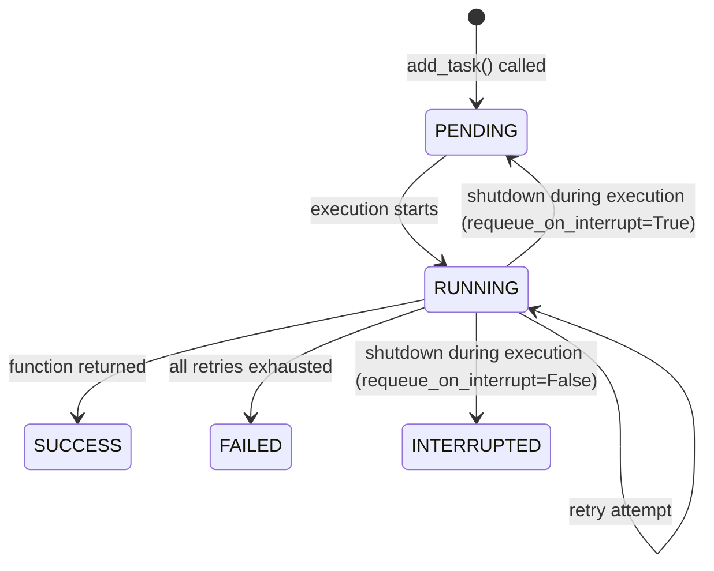

# Defining Tasks

Tasks are registered using the `@task_manager.task()` decorator. The decorator stores execution configuration alongside the function and makes it available to the retry and tracking layer at runtime.

## Basic definition

```python
@task_manager.task()
def send_email(address: str) -> None:
    ...
```

Without any arguments, the task runs once with no retries.

## Decorator options

| Parameter | Type | Default | Description |
|-----------|------|---------|-------------|
| `retries` | `int` | `0` | Number of additional attempts after the first failure |
| `delay` | `float` | `0.0` | Seconds to wait before the first retry |
| `backoff` | `float` | `1.0` | Multiplier applied to `delay` on each retry. 1.0 = constant, 2.0 = exponential |
| `persist` | `bool` | `False` | Mark this task for pending-state requeue on startup |
| `name` | `str` | function name | Override the name stored in the registry and dashboard |
| `requeue_on_interrupt` | `bool` | `False` | If the task was mid-execution at shutdown, save it as `PENDING` and requeue on next startup. Only use this on idempotent tasks. |

## Retry example

```python
@task_manager.task(retries=3, delay=1.0, backoff=2.0)
def send_email(address: str) -> None:
    ...
```

On failure this task will retry up to 3 times with delays of 1s, 2s, and 4s.

## Async tasks

```python
@task_manager.task(retries=1, delay=0.5)
async def process_webhook(payload: dict) -> None:
    await some_http_client.post("/endpoint", json=payload)
```

Async functions are awaited directly inside the executor. No extra setup needed.

## Task lifecycle



`INTERRUPTED` tasks are visible in the dashboard and queryable via the API. They are not retried automatically. Use `INTERRUPTED` to identify tasks that need manual follow-up after an unclean shutdown.

## Unregistered functions

You can call `add_task` with a plain function that has no decorator. It will still be tracked with a UUID and a default config (no retries). The decorator is only required if you want retry behaviour or persistence.

```python
def plain_work() -> None:
    ...

background_tasks.add_task(plain_work)  # tracked, no retries
```
