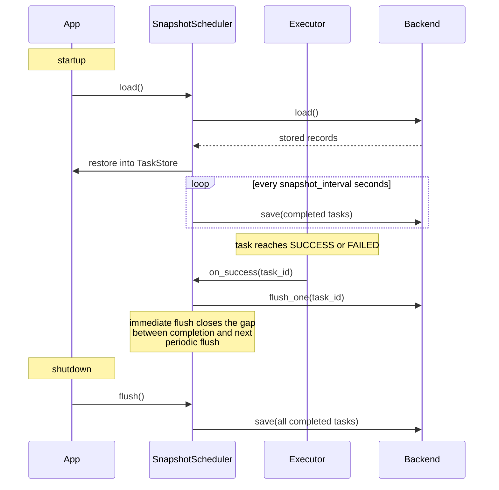

# Persistence

By default, fastapi-taskflow holds all task state in memory. When the app restarts, that state is gone. Persistence saves completed task history to a backend so it survives restarts and is visible in the dashboard on the next run.

## SQLite (default)

```python
from fastapi_taskflow import TaskManager

task_manager = TaskManager(snapshot_db="tasks.db", snapshot_interval=30.0)
```

`snapshot_interval` controls how often (in seconds) completed tasks are flushed to the database. On shutdown, a final flush runs regardless of the interval.

`TaskAdmin` registers the startup and shutdown lifecycle hooks automatically. No lifespan function needed.

## Redis

```bash
pip install "fastapi-taskflow[redis]"
```

```python
from fastapi_taskflow import TaskManager
from fastapi_taskflow.backends import RedisBackend

backend = RedisBackend("redis://localhost:6379/0")
task_manager = TaskManager(snapshot_backend=backend, snapshot_interval=30.0)
```

## Multi-instance deployments

When multiple instances share the same backend, completed task history is visible across all of them. Each instance flushes its completed tasks to the backend independently.

SQLite works for multiple processes on the same host pointing to the same file. WAL journal mode is enabled automatically so concurrent writes do not conflict.

Redis works across any number of instances on separate hosts. All instances read and write to the same Redis keys.

See the [multi-instance guide](multi-instance.md) for deployment setup and load balancer configuration.

## How persistence works



## Querying history

SQLite backend exposes a `query` method via `task_manager._scheduler`:

```python
# All failed tasks
records = task_manager._scheduler.query(status="failed")

# Failed tasks for a specific function, newest first
records = task_manager._scheduler.query(
    status="failed",
    func_name="send_email",
    limit=50,
)
```

!!! note
    `query()` is only available on `SqliteBackend`. It is not part of the `SnapshotBackend` ABC.

## Showing arguments in the dashboard

```python
from fastapi import FastAPI
from fastapi_taskflow import TaskAdmin, TaskManager

task_manager = TaskManager(snapshot_db="tasks.db")
app = FastAPI()

TaskAdmin(app, task_manager, display_func_args=True)
```

When enabled, the arguments passed to each task are stored alongside the record and displayed in the task detail panel. This is useful for debugging without digging through logs.
