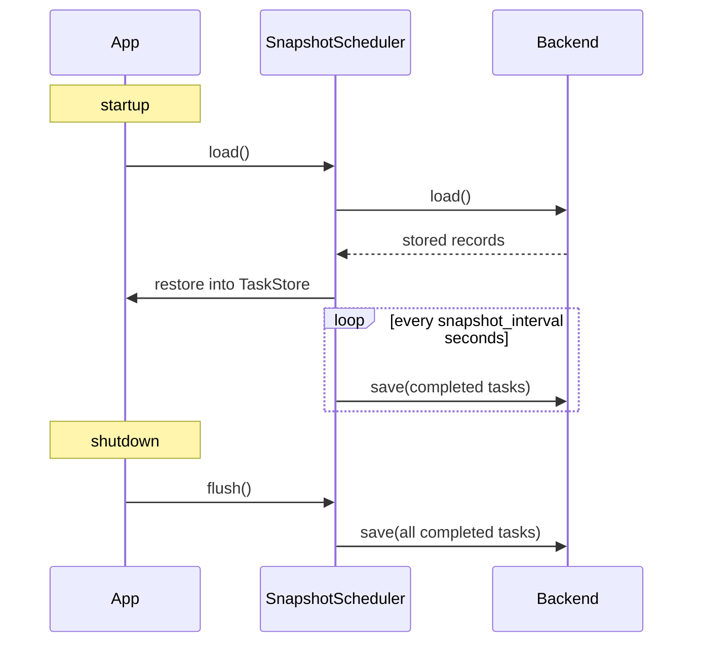

# Persistence

By default, fastapi-taskflow holds all task state in memory. When the app restarts, that state is gone. Persistence saves completed task history to a backend so it survives restarts and is visible in the dashboard on the next run.

## SQLite (default)

```python
task_manager = TaskManager(snapshot_db="tasks.db", snapshot_interval=30.0)
```

`snapshot_interval` controls how often (in seconds) completed tasks are flushed to the database. On shutdown, a final flush runs regardless of the interval.

`TaskAdmin` registers the startup and shutdown lifecycle hooks automatically. No lifespan function needed.

## Redis

```bash
pip install "fastapi-taskflow[redis]"
```

```python
from fastapi_taskflow.backends import RedisBackend

backend = RedisBackend("redis://localhost:6379/0")
task_manager = TaskManager(snapshot_backend=backend, snapshot_interval=30.0)
```

## How persistence works



## Querying history

SQLite backend exposes a `query` method via `task_manager._scheduler`:

```python
# All failed tasks
records = task_manager._scheduler.query(status="failed")

# Failed tasks for a specific function, newest first
records = task_manager._scheduler.query(
    status="failed",
    func_name="send_email",
    limit=50,
)
```

!!! note
    `query()` is only available on `SqliteBackend`. It is not part of the `SnapshotBackend` ABC.

## Showing arguments in the dashboard

```python
TaskAdmin(app, task_manager, display_func_args=True)
```

When enabled, the arguments passed to each task are stored alongside the record and displayed in the task detail panel. This is useful for debugging without digging through logs.
