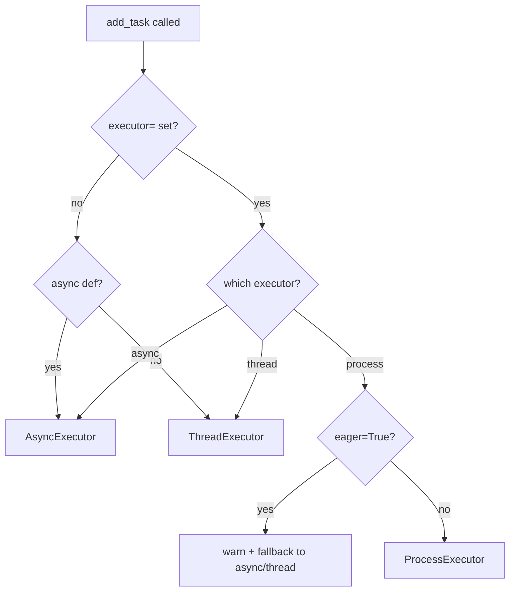

# Process Executor

This page covers the `executor='process'` option, which runs a task in a separate OS process using `concurrent.futures.ProcessPoolExecutor`. Use it for CPU-bound work that would otherwise saturate the event loop or stall the thread pool.

## When to use it

The process executor is the right choice for tasks that are CPU-bound: image processing, PDF rendering, data compression, numerical computation, and report generation. Each worker is a separate Python interpreter, so the GIL does not apply and multiple workers genuinely run in parallel on separate cores.

For IO-bound tasks, async or thread executors are more efficient. The overhead of spawning a process and pickling arguments is not justified when the bottleneck is network or disk latency.

## Basic example

```python
from fastapi_taskflow import TaskManager

task_manager = TaskManager()

@task_manager.task(executor="process")
def generate_pdf(report_id: int) -> bytes:
    # CPU-heavy work - runs in a separate OS process
    return render_pdf(report_id)
```

With cloudpickle installed (`pip install "fastapi-taskflow[process]"`), the function can be defined anywhere: closures, nested functions, and class methods all work. Without it, the function must be at module level. See [Constraints](#constraints) below.

## Configuration

Two `TaskManager` constructor parameters control the process pool:

| Parameter | Type | Default | Description |
|-----------|------|---------|-------------|
| `max_process_workers` | `int \| None` | `None` | Number of worker processes. `None` uses `os.cpu_count()`. |
| `process_shutdown_timeout` | `float` | `30.0` | Seconds to wait for in-flight workers at shutdown before terminating them forcefully. |

```python
import os
from fastapi_taskflow import TaskManager

task_manager = TaskManager(
    max_process_workers=os.cpu_count(),
    process_shutdown_timeout=60.0,
)

@task_manager.task(executor="process")
def crunch_data(dataset_id: int) -> dict:
    ...
```

## Constraints

### Depends on cloudpickle

Install `fastapi-taskflow[process]` to get cloudpickle. Without it, these three constraints apply in their stricter form.

- **Functions:** with cloudpickle, any function works: closures, lambdas, nested functions, class methods. Without it, the function must be at module level or `ValueError` is raised at decoration time.
- **Arguments:** with cloudpickle, lambdas, closures, and locally-defined classes are accepted. Without it, standard pickle only. OS-level resources (file handles, sockets, database connections) cannot cross a process boundary regardless. Pass an ID or path instead.
- **Return values:** must be serializable via the standard IPC transport. Non-serializable return values raise at task completion.

### Always applies

- **Logs:** `task_log()` entries are collected in the worker and delivered after the function returns. They appear in the dashboard all at once, not incrementally.
- **Eager dispatch:** when `eager=True` is also set, the process executor is bypassed with a warning and the task runs in-process.
- **Start method:** the pool uses `spawn`, not `fork`. Each worker starts with a clean interpreter state.

## Installing cloudpickle

cloudpickle is an optional dependency. Install it with:

```
pip install "fastapi-taskflow[process]"
```

Without it, fastapi-taskflow falls back to standard `pickle`. Standard pickle rejects lambdas, closures, and locally-defined classes, both as the task function itself and as arguments. cloudpickle handles all of those. Neither serializer can handle OS-level resources.

## TaskArgumentError

`TaskArgumentError` is raised at `add_task()` time when arguments cannot be serialized. It extends `ValueError`. Catch it at the call site to handle it gracefully:

```python
from fastapi_taskflow import TaskArgumentError

try:
    task_id = tasks.add_task(generate_pdf, report_id)
except TaskArgumentError as exc:
    raise HTTPException(status_code=422, detail=str(exc))
```

## Using task_log inside process tasks

`task_log()` works inside process tasks. Entries are buffered in the worker and sent to the parent after the function returns. They appear in the dashboard and observer chain at that point, not during execution.

```python
from fastapi_taskflow import task_log

@task_manager.task(executor="process")
def process_dataset(dataset_id: int) -> dict:
    task_log(f"Loading dataset {dataset_id}")
    data = load(dataset_id)
    task_log(f"Processing {len(data)} rows")
    result = crunch(data)
    task_log("Done")
    return result
```

## Scheduled process tasks

`@task_manager.schedule()` supports `executor='process'` using the same syntax:

```python
@task_manager.schedule(every=3600, executor="process")
def rebuild_search_index() -> None:
    ...
```

## How the executor is selected



## Without cloudpickle installed

If you are not using the `[process]` extra, the function location constraint applies. These patterns raise `ValueError` at decoration time:

**Inside a test function:**
```python
def test_my_task():
    @task_manager.task(executor="process")  # ValueError without cloudpickle
    def my_proc(n: int) -> int:
        return n * 2
```

**Inside a class:**
```python
class ReportService:
    @task_manager.task(executor="process")  # ValueError without cloudpickle
    def generate(self, report_id: int) -> bytes:
        ...
```

**Inside a factory function:**
```python
def make_processor(config):
    @task_manager.task(executor="process")  # ValueError without cloudpickle
    def process():
        ...
    return process
```

The fix without cloudpickle is to define the function at module level. With cloudpickle installed, all of the above work without changes.

## Constraints summary

**Depends on cloudpickle (`pip install "fastapi-taskflow[process]"`):**

- **Functions:** no location restriction with cloudpickle; module-level only without it.
- **Arguments:** cloudpickle accepts lambdas, closures, and locally-defined classes; standard pickle only without it. OS resources always fail regardless.
- **Return values:** must be serializable via the standard IPC transport.

**Always applies:**

- Logs delivered after completion, not in real time.
- Eager dispatch bypassed with a warning.
- Pool uses `spawn` start method, not `fork`.
