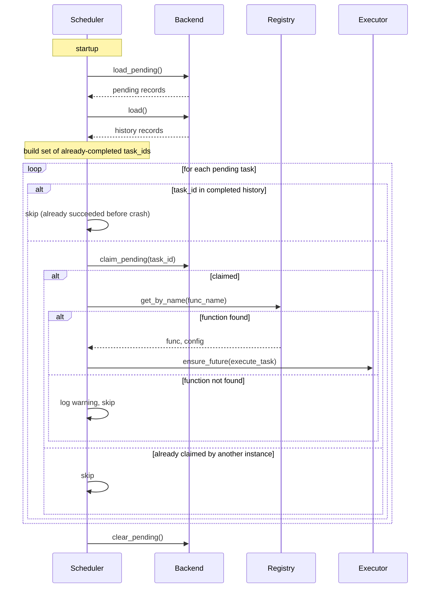

# Pending Requeue

When an app shuts down, tasks that had not finished are saved and re-dispatched on the next startup. This requires `requeue_pending=True` and a persistence backend.

## Enable requeue

```python
task_manager = TaskManager(
    snapshot_db="tasks.db",
    requeue_pending=True,
)
```

## What happens on shutdown

All tasks in `PENDING` or `RUNNING` state are written to the pending store. What happens to each depends on whether it was started:

- `PENDING` tasks (never started) are saved as-is and will be re-dispatched.
- `RUNNING` tasks (mid-execution at shutdown) are handled based on the `requeue_on_interrupt` flag on the task decorator.

## RUNNING tasks at shutdown

A task that was executing when the app shut down may have already performed side effects such as sending an email or calling an external API. Re-running it from scratch could cause duplicates.

The default behaviour is to save `RUNNING` tasks to history with status `INTERRUPTED`. They appear in the dashboard but are not re-executed automatically.

If a task is safe to run from scratch even if it was partially executed (for example, a database sync using upserts), you can opt in to requeue on interrupt:

```python
@task_manager.task(retries=2, requeue_on_interrupt=True)
def sync_user_data(user_id: int) -> None:
    # uses upsert semantics -- safe to run twice
    ...
```

Tasks marked `requeue_on_interrupt=True` are saved as `PENDING` and re-dispatched on next startup.

Tasks without the flag are saved as `INTERRUPTED` and are not re-dispatched.

```python
@task_manager.task(retries=3)
def send_welcome_email(user_id: int) -> None:
    # sends an email -- not safe to run twice
    ...
```

## Task statuses at a glance

| Status | Meaning |
|--------|---------|
| `PENDING` | Queued, not yet started |
| `RUNNING` | Currently executing |
| `SUCCESS` | Completed successfully |
| `FAILED` | All retries exhausted |
| `INTERRUPTED` | Was running at shutdown, not requeued |

## What happens on startup

The pending store is read. Each task is matched back to its registered function by name. If the function is still registered, the task is re-dispatched. If the function is no longer registered, the task is skipped with a warning log.

In a multi-instance deployment, the pending store is claimed atomically so only one instance dispatches each task. See the [multi-instance guide](multi-instance.md) for details.



## Crash recovery

On a clean shutdown (SIGTERM, Uvicorn graceful stop), the pending store is written and requeue works as described above.

On a hard crash (SIGKILL, OOM kill, power loss), the shutdown hook never runs and the pending store is not written. Tasks that were running at the time of the crash are lost.

There is no way to recover from a hard crash at the framework level. Tasks that must not be lost under any circumstance need an external coordination mechanism outside this library.

## Things to be aware of

- Requeued tasks start from scratch. There is no partial execution state.
- Only mark `requeue_on_interrupt=True` on tasks whose function body is idempotent.
- The pending store is separate from the history store. Requeued tasks appear as new records in history once they complete.
- `INTERRUPTED` tasks are visible in the dashboard and queryable via the API. They are not retried automatically.
