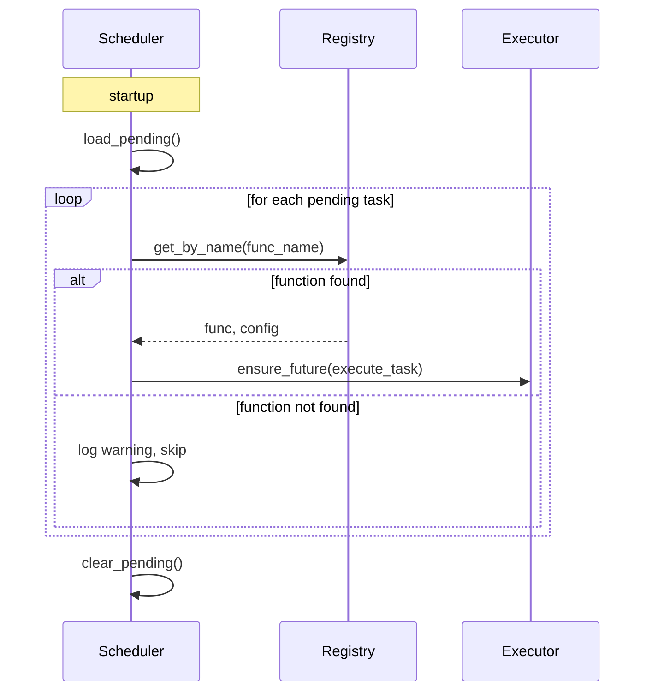

# Pending Requeue

When an app shuts down unexpectedly or under load, some tasks may still be in `PENDING` or `RUNNING` state. Without requeue, those tasks are silently lost.

With `requeue_pending=True`, fastapi-taskflow saves unfinished tasks on shutdown and re-dispatches them on the next startup.

## Enable requeue

```python
task_manager = TaskManager(
    snapshot_db="tasks.db",
    requeue_pending=True,
)
```

## What happens on shutdown

Tasks in `PENDING` or `RUNNING` state are written to a separate pending store in the backend. Tasks that were `RUNNING` are normalised back to `PENDING` before saving because they did not complete cleanly.

## What happens on startup

The pending store is read. Each task is matched back to its registered function by name. If the function is still registered in the current process, the task is re-dispatched via `asyncio.ensure_future`. If the function is no longer registered (e.g. it was renamed or removed), the task is skipped with a warning log and dropped.

After all tasks are dispatched, the pending store is cleared so they are not re-dispatched again on the next restart.



## Marking tasks for requeue

Only tasks decorated with `persist=True` are eligible for the requeue flow:

```python
@task_manager.task(retries=3, delay=1.0, persist=True)
def send_email(address: str) -> None:
    ...
```

Tasks without `persist=True` are tracked in memory but not written to the pending store on shutdown.

## Things to be aware of

- Requeued tasks start from scratch. There is no partial execution state.
- If a task was in `RUNNING` state at shutdown, it may run a second time. Make sure your task functions are safe to run more than once.
- The pending store is separate from the history store. Requeued tasks appear as new records in the history once they complete.
