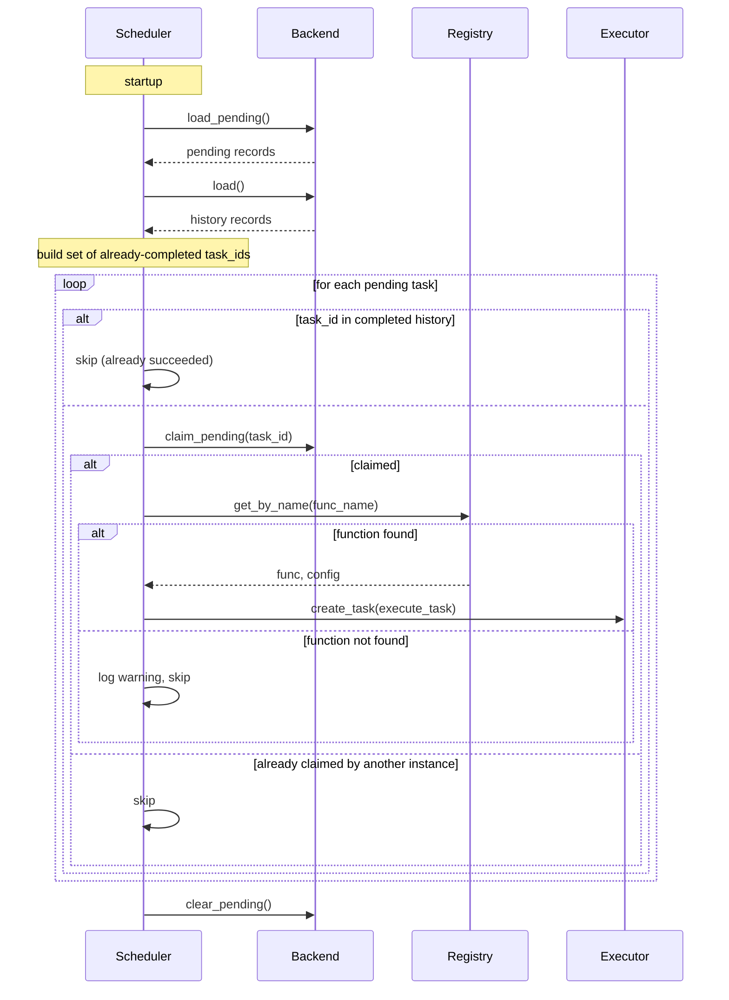

# Pending Requeue

When your application stops, tasks that have not finished yet are normally lost. Requeue lets you save those tasks at shutdown and dispatch them again on the next startup.

This page explains the two configuration flags that control this behavior, what happens to each task at shutdown depending on its state, and what the limitations are.

## The two flags

Requeue behavior is controlled by two separate flags that work together.

**`requeue_pending`** (on the manager) or **`persist`** (on the decorator) activates the requeue machinery. Without one of these, no pending store is written at shutdown and nothing is re-dispatched at startup.

**`requeue_on_interrupt`** (on the decorator) controls what happens to a specific task if it was mid-execution at shutdown. Without this, an interrupted task is recorded as `INTERRUPTED` in history but not re-dispatched.

Both must be in place for an interrupted task to come back on startup.

## Enabling requeue

To enable requeue for the whole application, set `requeue_pending=True` on the manager:

```python
task_manager = TaskManager(
    snapshot_db="tasks.db",
    requeue_pending=True,
)
```

To enable it for a single task without touching the manager, use `persist=True` on the decorator. This activates the same machinery but scoped to that function:

```python
@task_manager.task(persist=True, requeue_on_interrupt=True)
def build_report(report_id: int) -> None:
    ...
```

You can mix both. Tasks decorated with `persist=True` activate the requeue path even if the manager does not have `requeue_pending=True`.

## What happens at shutdown

At shutdown, every task in a `PENDING` or `RUNNING` state is examined.

**PENDING tasks** (queued but not yet started) are saved to the pending store and re-dispatched on the next startup. This requires `requeue_pending=True` on the manager or `persist=True` on the task decorator, but does not require `requeue_on_interrupt`.

**RUNNING tasks** (mid-execution at shutdown) require `requeue_on_interrupt=True` on the decorator. If that flag is set, the task is saved as `PENDING` and re-dispatched. If the flag is not set, the task is saved to history as `INTERRUPTED` and left for manual review.

| `persist` or `requeue_pending` | `requeue_on_interrupt` | Task was mid-execution | Result |
|---|---|---|---|
| true | true | yes | Saved as PENDING, re-dispatched on startup |
| true | false | yes | Saved as INTERRUPTED, visible in dashboard, not re-dispatched |
| true | true or false | no (was PENDING) | Re-dispatched on startup |
| false | any | any | Not saved, lost on restart |

## The idempotency requirement

A task that was interrupted mid-execution may have already completed some of its work. Re-dispatching it means running the full function again from scratch with the same arguments.

Only set `requeue_on_interrupt=True` if the task function produces the same outcome whether it runs once or multiple times. This property is called idempotency.

A database upsert is a good example of an idempotent operation:

```python
@task_manager.task(persist=True, requeue_on_interrupt=True)
def sync_inventory(product_id: int) -> None:
    db.execute(
        "INSERT INTO inventory (id, stock) VALUES (?, ?)"
        " ON CONFLICT(id) DO UPDATE SET stock = excluded.stock",
        (product_id, fetch_stock(product_id)),
    )
```

Running this twice leaves the database in the same state as running it once.

An email send is not idempotent:

```python
@task_manager.task(retries=3)
def send_welcome_email(user_id: int) -> None:
    email_client.send(get_user_email(user_id), template="welcome")
```

If this task is interrupted and re-dispatched, the user receives the email twice. Do not set `requeue_on_interrupt=True` here.

!!! warning
    Idempotency must hold for the entire function body, not just the final write. If the function calls an external API partway through and then writes to a database, both operations must be safe to repeat.

## How re-dispatch works at startup

On startup, the scheduler reads the pending store and dispatches each saved task. The steps are:

1. Load all pending records from the store.
2. Cross-check against history. Tasks that already completed successfully (flushed before the crash) are skipped.
3. Claim each task atomically. In a multi-instance deployment, only one instance picks up each task even if several instances start at the same time.
4. Look up the registered function by name. If the function is no longer registered (for example, it was renamed between deploys), the task is skipped with a warning log and left in the pending store.
5. Dispatch matching tasks via `asyncio.create_task`.

Requeued tasks start from scratch. They receive the same arguments as the original call and run from the beginning of the function.



## Task statuses at a glance

| Status | Meaning |
|---|---|
| `PENDING` | Queued, not yet started |
| `RUNNING` | Currently executing |
| `SUCCESS` | Completed without error |
| `FAILED` | All retries exhausted |
| `INTERRUPTED` | Was running at shutdown, not requeued |

## Hard crash limitation

Requeue works when the server shuts down gracefully. On a graceful shutdown (SIGTERM, Ctrl+C, or a programmatic stop), the shutdown hook runs, the pending store is written, and tasks are available for re-dispatch on the next startup.

On a hard crash (SIGKILL, OOM kill, or power loss), the shutdown hook never runs. Tasks that were running or queued at that moment are not written to the pending store and cannot be recovered.

The periodic snapshot flush (every 60 seconds by default) does protect completed tasks from hard crashes. A task that finished between the last flush and the crash is saved and will not be re-executed. But a task that was still running at the time of the crash is lost.

!!! warning
    If your application must not lose tasks under any circumstance, including hard crashes, you need a durable external queue outside this library. Requeue covers the common case of graceful restarts and deploys, not arbitrary process death.

## Deployment checklist

- Confirm your deployment sends SIGTERM before SIGKILL. Docker stop and Kubernetes pod deletion both do this. The default grace period is 10 seconds for Docker and 30 seconds for Kubernetes.
- Set your grace period long enough for in-flight tasks to finish or at least be written to the pending store. A task that is still executing when SIGKILL arrives is lost even with requeue enabled.
- Check the dashboard for `INTERRUPTED` tasks after deploys. If they appear regularly, your grace period may be too short for the work your tasks are doing.
- The pending store is separate from the history store. Requeued tasks appear as new records in history once they complete on the next startup.
