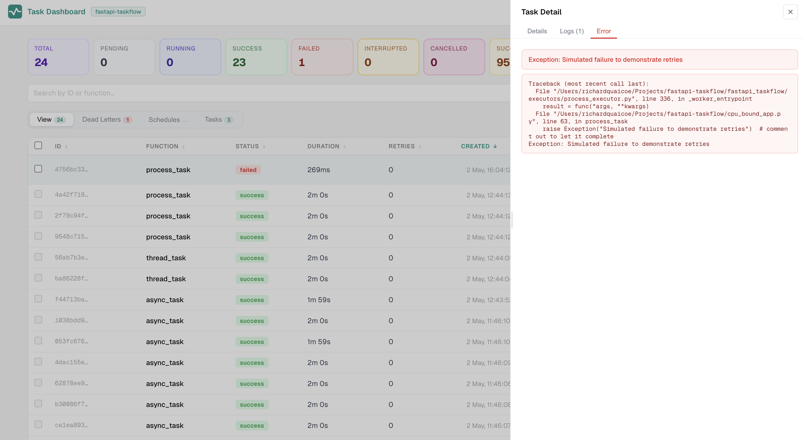

---
hide:
  - navigation
  - toc
---

<div class="hero">
  <h1>Turn <span class="hero-accent">FastAPI BackgroundTasks</span> into a production-ready task system</h1>
  <p class="sub">Retries, control, resiliency and visibility without workers or brokers.</p>
  <div class="hero-actions">
    <a class="btn btn-primary" href="getting-started/installation/">Get Started</a>
    <a class="btn btn-secondary" href="getting-started/quickstart/">Quick Start</a>
  </div>
</div>

<div class="home-page">

<div class="problem-section">
  <div class="problem-header">
    <p class="section-label">The problem</p>
    <p class="section-title">BackgroundTasks is fine, until it isn't</p>
    <p class="problem-desc">FastAPI's <code>BackgroundTasks</code> is great for simple work. But in production you hit the same gaps fast, tasks fail silently, nothing is tracked, and restarts wipe all state.</p>
  </div>
  <div class="compare-grid">
    <div class="compare-col before">
      <h4>Without fastapi-taskflow</h4>
      <ul>
        <li>No retries on failure</li>
        <li>No task IDs or status</li>
        <li>No visibility into what ran</li>
        <li>No history after restart</li>
        <li>No metrics or duration</li>
        <li>No logs or error traces</li>
      </ul>
    </div>
    <div class="compare-col">
      <h4>With fastapi-taskflow</h4>
      <ul>
        <li>Automatic retries with backoff</li>
        <li>UUID per task, full lifecycle</li>
        <li>Live dashboard over SSE</li>
        <li>SQLite or Redis persistence</li>
        <li>Success rate and duration metrics</li>
        <li>Per-task logs and full stack traces</li>
      </ul>
    </div>
  </div>
</div>

<div class="code-section">
  <p class="section-label">Quick look</p>
  <p class="section-title">Looks like FastAPI. Works like a task system.</p>

```python
from fastapi import BackgroundTasks, FastAPI
from fastapi_taskflow import TaskAdmin, TaskManager, task_log

task_manager = TaskManager(snapshot_db="tasks.db")
app = FastAPI()
TaskAdmin(app, task_manager, auto_install=True)


@task_manager.task(retries=3, delay=1.0, backoff=2.0)
def send_email(address: str) -> None:
    task_log(f"Sending to {address}")
    ...  # your logic here


@app.post("/signup")
def signup(email: str, background_tasks: BackgroundTasks):
    task_id = background_tasks.add_task(send_email, address=email)
    return {"task_id": task_id}
```

  <p class="code-note">The route signature does not change. <code>auto_install=True</code> handles the rest. <a href="getting-started/quickstart/">Read the Quick Start &rarr;</a></p>
</div>

<div class="dashboard-section">
  <p class="section-label">Dashboard</p>
  <p class="section-title">Live visibility out of the box</p>
  <div class="preview-tabs">
    <button class="preview-tab preview-tab--active" onclick="showPreview(this,'preview-dashboard')">Dashboard</button>
    <button class="preview-tab" onclick="showPreview(this,'preview-logs')">Logs</button>
    <button class="preview-tab" onclick="showPreview(this,'preview-error')">Error</button>
  </div>
  <div class="dashboard-preview">
    <div id="preview-dashboard" class="preview-panel preview-panel--active">
      <a href="assets/images/dashboard.png" target="_blank" class="img-link">
        
      </a>
    </div>
    <div id="preview-logs" class="preview-panel">
      <a href="assets/images/logs.png" target="_blank" class="img-link">
        
      </a>
    </div>
    <div id="preview-error" class="preview-panel">
      <a href="assets/images/error.png" target="_blank" class="img-link">
        
      </a>
    </div>
  </div>
  <script>
  function showPreview(btn, panelId) {
    btn.closest('.dashboard-section').querySelectorAll('.preview-tab').forEach(function(t){ t.classList.remove('preview-tab--active'); });
    btn.closest('.dashboard-section').querySelectorAll('.preview-panel').forEach(function(p){ p.classList.remove('preview-panel--active'); });
    btn.classList.add('preview-tab--active');
    document.getElementById(panelId).classList.add('preview-panel--active');
  }
  </script>
</div>

<div class="section">
  <p class="section-label">Features</p>
  <p class="section-title">Everything you need, nothing you don't</p>
  <div class="feature-grid">

  <div class="feature-card">
    <span class="icon">↩</span>
    <h3>Automatic Retries</h3>
    <p>Configure retries, delay, and exponential backoff per function using a single decorator.</p>
  </div>

  <div class="feature-card">
    <span class="icon">◎</span>
    <h3>Task Lifecycle Tracking</h3>
    <p>Every task gets a UUID and moves through PENDING, RUNNING, SUCCESS, and FAILED states.</p>
  </div>

  <div class="feature-card">
    <span class="icon">▦</span>
    <h3>Live Dashboard</h3>
    <p>A real-time admin panel at <code>/tasks/dashboard</code> with filtering, search, and task detail.</p>
  </div>

  <div class="feature-card">
    <span class="icon">⊞</span>
    <h3>Pluggable Persistence</h3>
    <p>SQLite out of the box. Redis available as an optional extra. Custom backends via a simple ABC.</p>
  </div>

  <div class="feature-card">
    <span class="icon">⟳</span>
    <h3>Pending Requeue</h3>
    <p>Tasks that did not finish before shutdown are saved and re-dispatched on next startup. Tasks interrupted mid-execution are marked INTERRUPTED or requeued based on a per-task flag.</p>
  </div>

  <div class="feature-card">
    <span class="icon">⇌</span>
    <h3>Zero-Migration Injection</h3>
    <p>Keep your existing <code>background_tasks: BackgroundTasks</code> signatures. One line at startup is all it takes.</p>
  </div>

  <div class="feature-card">
    <span class="icon">≡</span>
    <h3>Task Logging</h3>
    <p>Call <code>task_log()</code> inside any task to capture timestamped log entries. Logs and full stack traces appear in the dashboard detail panel.</p>
  </div>

  <div class="feature-card">
    <span class="icon">◈</span>
    <h3>Idempotency Keys</h3>
    <p>Pass an <code>idempotency_key</code> to <code>add_task()</code> to prevent the same logical operation from running twice, even across multiple instances.</p>
  </div>

  <div class="feature-card">
    <span class="icon">⊕</span>
    <h3>Multi-Instance Support</h3>
    <p>Run multiple instances behind a load balancer with SQLite (same host) or Redis (any host). Requeue claiming is atomic. Task history is shared across all instances.</p>
  </div>

  </div>
</div>

<div class="note-section">
  <p class="section-label">Positioning</p>
  <p class="section-title">Not a Celery replacement</p>
  <p>fastapi-taskflow does not compete with Celery, ARQ, Taskiq, or Dramatiq. Those tools are built for distributed workers, message brokers, and high-throughput task routing across separate machines.</p>
  <p>This library is for teams using FastAPI's native <code>BackgroundTasks</code> who want retries, visibility, and resilience without adding worker infrastructure. It supports multi-instance deployments with a shared SQLite file (same host) or Redis (any host), including atomic requeue claiming, idempotency keys, and shared task history across instances.</p>
  <p>If your tasks need to run on dedicated worker processes completely separate from your web application, use a proper task queue.</p>
  <p><a href="getting-started/installation/">Get started &rarr;</a></p>
</div>

</div>
